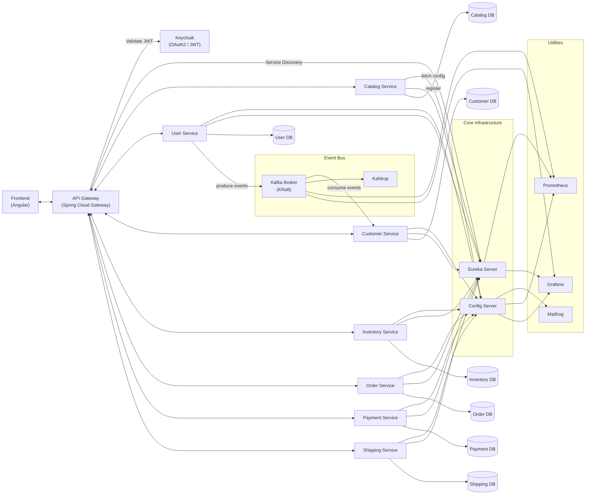

# 🛒 E-Commerce Platform – Microservices Architecture

Welcome to my personal e-commerce platform project — a fully modular microservices-based system built with modern backend technologies and a responsive Angular frontend. This project is designed as a real-world showcase of enterprise architecture patterns and best practices, focusing on scalability, maintainability, and secure communication.

---

## 🌟 Features

- Microservice-based architecture with Spring Boot
- API Gateway for request routing and filtering
- Centralized configuration via Spring Cloud Config Server
- Service discovery with Eureka
- OAuth2-based authentication and authorization
- Kafka for asynchronous communication
- PostgreSQL databases
- Angular frontend SPA
- Dockerized deployment

---

## 🧱 Architecture Overview
TO BE ADDED


---

## 📦 Services

| Service             | Description                                                       |
|---------------------|-------------------------------------------------------------------|
| `api-gateway`       | Routes requests and applies filters                               |
| `user-service`      | Manages User-related operations, OAuth2 login, JWT token issuance |
| `catalog-service`   | Handles product listing and search                                |
| `customer-service`  | Manages customer data and profiles                                |
| `order-service`     | Processes customer orders                                         |
| `payment-service`   | Simulates payment transactions                                    |
| `shipping-service`  | Handles shipping details                                          |
| `inventory-service` | Tracks stock availability                                         |
| `config-server`     | Externalized, centralized configuration                           |
| `eureka-server`     | Service registry                                                  |
| `ecommerce-platform-frontend`          | Angular SPA for customer interaction                              |

---

## 🛠️ Tech Stack

**Backend**
- Java 21
- Spring Boot 3.4+
- Spring Cloud Gateway
- Spring Security + OAuth2
- Spring Cloud Config
- Apache Kafka
- PostgreSQL
- Hibernate
- Maven
- Docker

**Frontend**
- Angular 19+
- Angular Material
- RxJS
- RESTful communication

---

## 🚀 Getting Started

### Prerequisites
- Java 21
- Docker & Docker Compose
- Node.js & Angular CLI (for frontend)

### Run Util Services with Docker Compose

```bash

cd ./docker
docker-compose -f docker/docker-compose-utils.yml up -d

```

> This will spin up all backend services, Keycloak, its datbase, Kafka, Kafdrop, Mailhog, Prometheus, and Grafana.

```bash

cd ./docker
docker-compose -f docker/docker-compose.yml up -d

```

> This will spin up all backend services, the API gateway, and PostgreSQL databases. Currently not fully optimized. It's advised to start the services one by one as a standard Java application.
### Run Frontend

```bash

cd ./ecommerce-platform-frontend
npm install
ng serve
```

Then go to [http://localhost:4200](http://localhost:4200) to access the Angular app.

---

## 🔐 Security

Authentication is implemented using OAuth2 and JWT. The User-service in cooperation with Keycloak handle login requests and issue JWT tokens, which are then validated by the API Gateway and microservices.

---

## 📂 Repository Structure

```
ecommerce-platform/
│
├── api-gateway-service/
├── catalog-service/
├── common-events/
├── config-server/
├── customer-service/
├── data/
├── docker/
├── ecommerce-platform-frontend/
├── eureka-server/
├── inventory-service/
├── order-service/
├── payment-service/
├── shipping-service/
├── user-service/
├── HELP.md
└── pom.xml
```


---

## 📈 Monitoring (Coming Soon)
- Prometheus & Grafana integration for real-time metrics

---

## 🙌 Why This Project?

This is a hands-on learning project to sharpen my architecture, backend, and cloud-native development skills. It mirrors common challenges found in real-world distributed systems.

---

## 🧪 Future Improvements

- Unit and integration tests per service
- Full CI/CD pipeline (GitHub Actions or Jenkins)
- Resilience with Circuit Breakers (Resilience4J)
- Distributed tracing (Zipkin)
- Admin UI for operational metrics

---

## 📬 Contact

Created with ❤️ by **Martin Dvořáček**  
📧 Feel free to connect: [LinkedIn](https://www.linkedin.com/in/dvoracekmartin/)
